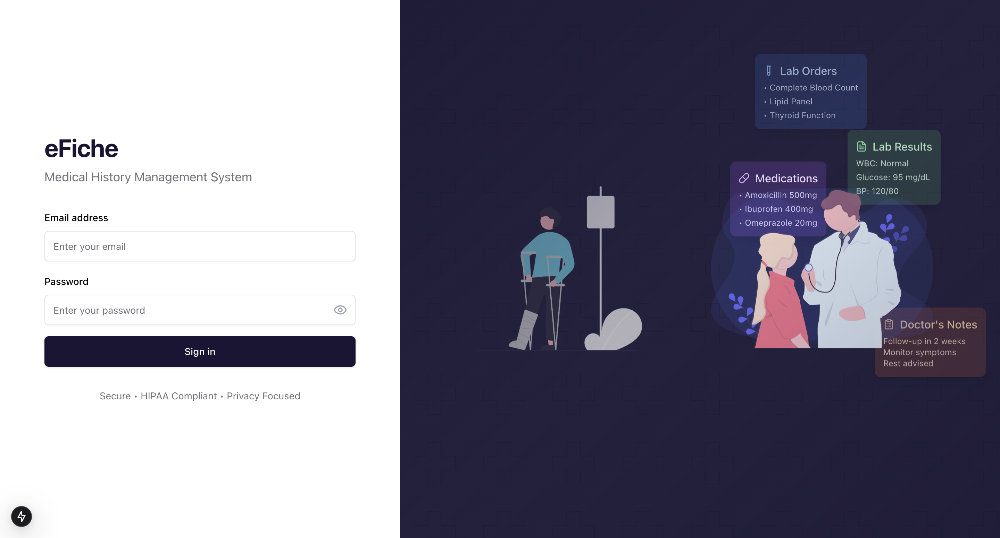
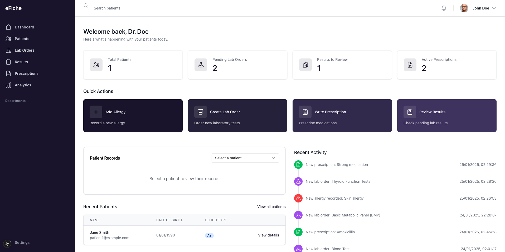
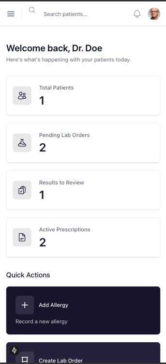
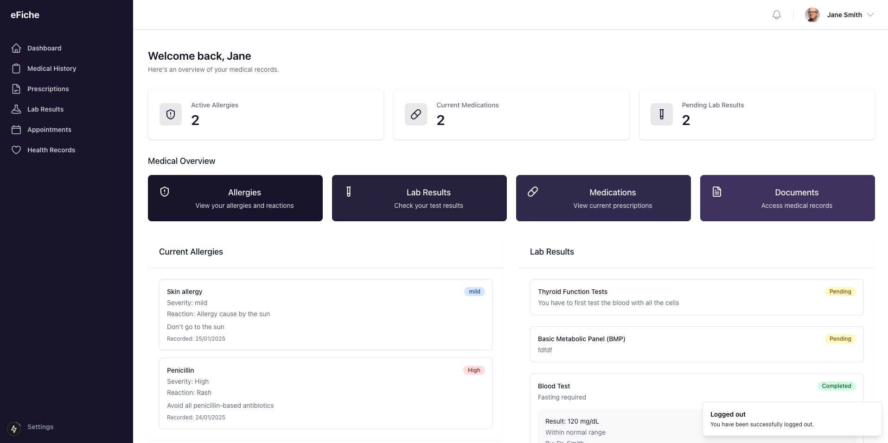

# 🏥 eFiche - Medical Records Management System

A modern, responsive web application for managing medical records, built with Next.js 14, TypeScript, and Tailwind CSS.







## 🌟 Features

### 👨‍⚕️ For Practitioners
- **Patient Management**
  - View and search patient lists
  - Access detailed patient records
  - Track medical history
  
- **Medical Records**
  - Add and manage allergies
  - Create lab orders
  - Record lab results
  - Manage prescriptions

- **Dashboard Analytics**
  - Patient statistics
  - Recent activities
  - Pending tasks overview

### 👤 For Patients
- **Personal Health Records**
  - View medical history
  - Track current prescriptions
  - Monitor lab results
  - Access allergy information

- **User-Friendly Interface**
  - Intuitive navigation
  - Real-time updates
  - Mobile responsive design

## 🚀 Getting Started

### Prerequisites
- Node.js (v18 or higher)
- npm or yarn
- Git

### Installation

1. Clone the repository
```bash
git clone git@github.com:Jaman-dedy/medical-history-frontend.git
cd efiche
```

2. Install dependencies
```bash
npm install
# or
yarn install
```

3. Set up environment variables
```bash
cp .env.example .env.local
```
Edit `.env.local` with your configuration:
```env
NEXT_PUBLIC_API_URL=Dev or hosted uer here
```

4. Run the development server
```bash
npm run dev
# or
yarn dev
```

Visit `http://localhost:3000` to see the application.

## 🏗️ Project Structure

```
src/
├── app/                    # Next.js app router pages
│   ├── practitioner/      # Practitioner routes
│   └── patient/           # Patient routes
├── components/            # Reusable components
│   ├── ui/               # UI components (shadcn/ui)
│   ├── practitioner/     # Practitioner-specific components
│   └── patient/          # Patient-specific components
├── store/                # Zustand store
│   ├── auth-store.ts     # Authentication store
│   └── patient-store.ts  # Patient data store
├── types/                # TypeScript type definitions
└── styles/               # Global styles
```

## 🛠️ Built With

- **Framework:** Next.js 14
- **Language:** TypeScript
- **Styling:** Tailwind CSS
- **State Management:** Zustand
- **UI Components:** shadcn/ui
- **Icons:** Lucide React
- **Forms:** React Hook Form
- **Authentication:** JWT

## 🔐 Security Features

- JWT-based authentication
- Role-based access control
- Secure password handling
- Protected API routes
- Input validation

## 🔄 State Management

We use Zustand for state management with separate stores for:
- Authentication
- Patient records
- Medical data
- User preferences

## 📱 Responsive Design

The application is fully responsive and works on:
- 💻 Desktop computers
- 📱 Mobile phones
- 📟 Tablets
- 🖥️ Large screens

## 🧪 Testing

```bash
# Run unit tests
npm run test

# Run e2e tests
npm run test:e2e

# Run linting
npm run lint
```

## 🚀 Deployment

1. Build the application
```bash
npm run build
```

2. Start the production server
```bash
npm start
```

## 📖 API Documentation

The frontend communicates with the backend through RESTful APIs:

- `/auth/*` - Authentication endpoints
- `/practitioner/*` - Practitioner-specific endpoints
- `/patient/*` - Patient-specific endpoints

For detailed API documentation, refer to the backend repository.

## 🤝 Contributing

1. Fork the repository
2. Create your feature branch (`git checkout -b feature/amazing-feature`)
3. Commit your changes (`git commit -m 'Add some amazing feature'`)
4. Push to the branch (`git push origin feature/amazing-feature`)
5. Open a Pull Request

## 📜 License

This project is licensed under the MIT License - see the [LICENSE.md](LICENSE.md) file for details.

## 👥 Authors

- **JAMAN DEDY* - *Initial work* - [Jaman-dedy](https://github.com/Jaman-dedy)

## 🙏 Acknowledgments

- Shadcn for the amazing UI components
- Tailwind team for the styling framework
- React
- Next.js team for the incredible framework
- The open-source community

## 📞 Support

For support, email support@efiche.com or join our Slack channel.

---

Made with ❤️ for healthcare professionals and patients